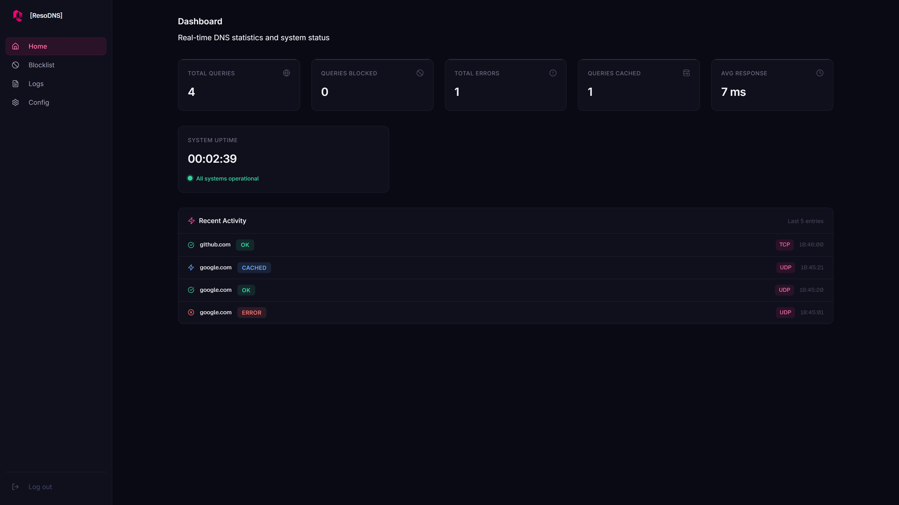
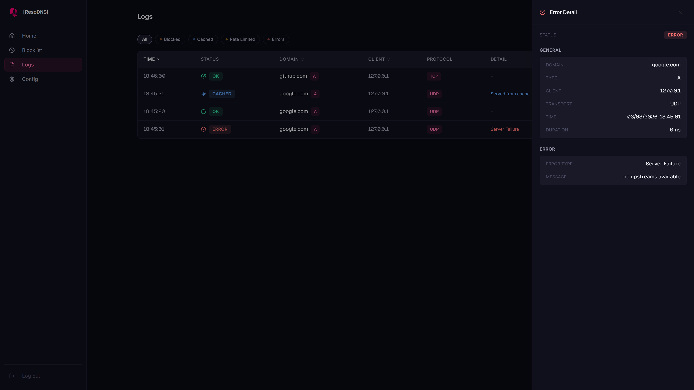
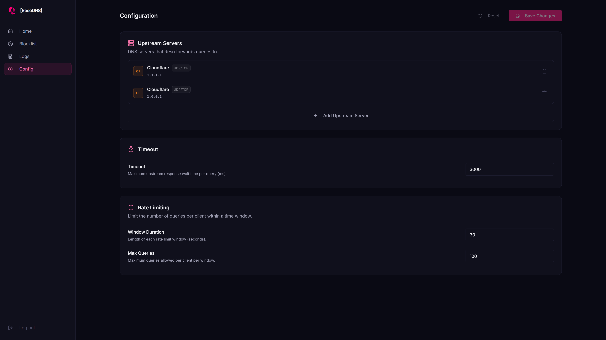
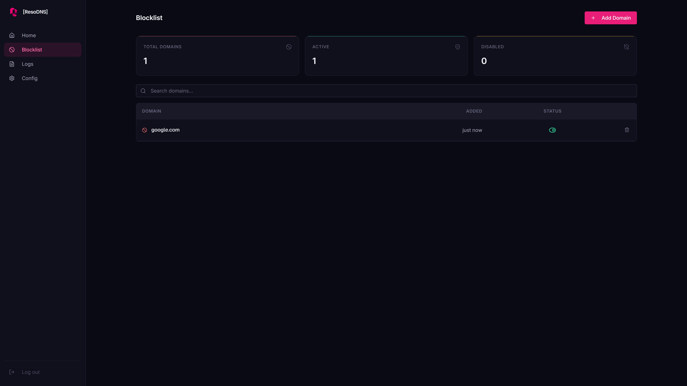

# reso-dns

> **Work in progress:** expect breaking changes and missing features.

A fast, self-hosted DNS resolver with a web UI. Supports forwarding over UDP and TCP, with query caching and domain blocking.

---



## Features

- **Web UI** built-in dashboard for monitoring and configuration
- **Query Cache** in-memory caching to reduce upstream lookups
- **Blocklist** domain blocking

## Screenshots






## Installation

### Docker Compose

Supports both `amd64` and `arm64` architectures.

1. Create a `docker-compose.yml`:

```yaml
services:
  reso:
    image: ghcr.io/thohui/reso-dns:latest
    network_mode: host
    cap_drop:
      - ALL
    cap_add:
      - NET_BIND_SERVICE
    read_only: true
    tmpfs:
      - /tmp
    volumes:
      - reso-data:/data
    environment:
      RESO_DATABASE_PATH: /data/reso.db
      RESO_METRICS_DATABASE_PATH: /data/reso_metrics.db
      RESO_DNS_SERVER_ADDRESS: 0.0.0.0:53
      RESO_HTTP_SERVER_ADDRESS: 0.0.0.0:80
      # generate with: openssl rand -base64 32
      RESO_COOKIE_SECRET: ${RESO_COOKIE_SECRET:?RESO_COOKIE_SECRET is required}

volumes:
  reso-data:
```

2. Start the container:

```sh
docker compose up -d
```

The web UI will be available at `http://<your-host>` and DNS on port 53.

## Configuration

| Variable                     | Default           | Description                                           |
| ---------------------------- | ----------------- | ----------------------------------------------------- |
| `RESO_DATABASE_PATH`         | `reso.db`         | Path to the SQLite database file                      |
| `RESO_METRICS_DATABASE_PATH` | `reso_metrics.db` | Path to the metrics SQLite database file              |
| `RESO_DNS_SERVER_ADDRESS`    | `0.0.0.0:53`      | Address the DNS server listens on                     |
| `RESO_HTTP_SERVER_ADDRESS`   | `0.0.0.0:80`      | Address the web UI/API listens on                     |
| `RESO_LOG_LEVEL`             | `info`            | Log level (`trace`, `debug`, `info`, `warn`, `error`) |
| `RESO_COOKIE_SECRET`         | —                 | Base64-encoded 32-byte secret for cookies (required)  |

## Development

### Prerequisites

- [Rust](https://rustup.rs/) 1.93+
- [pnpm](https://pnpm.io/installation)

### Build

```sh
cargo build
```

### Run

Copy the example env file and fill in the values:

```sh
cp reso/.env.example reso/.env
```

```sh
cargo run
```
