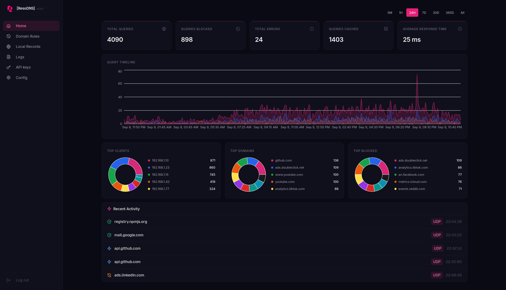
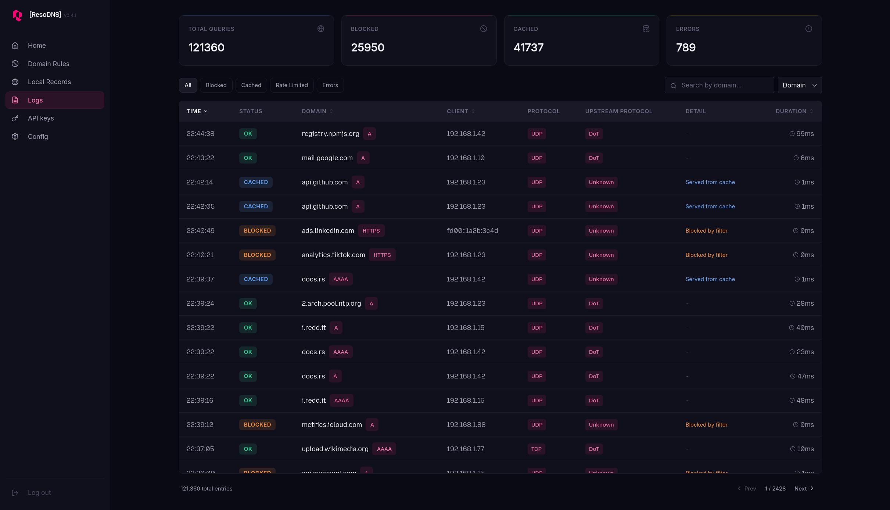
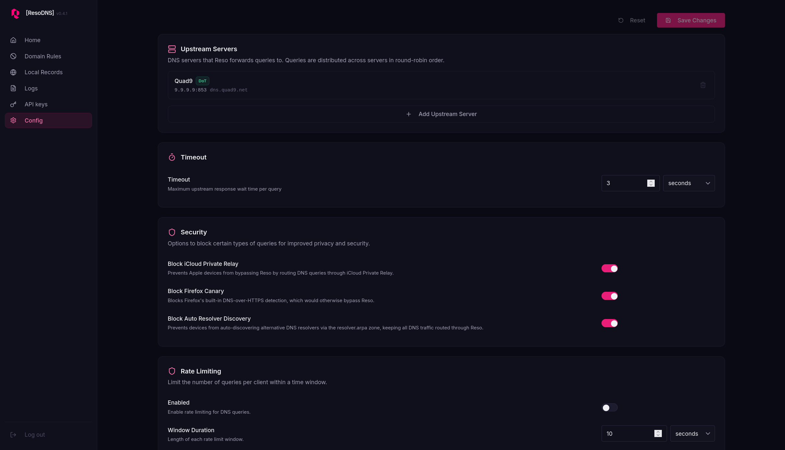

# ResoDNS

> **Work in progress:** expect breaking changes and missing features.

A fast, self-hosted DNS resolver with a web UI. Forwards over plain DNS or DNS over TLS, caches answers, and blocks domains.

---



## Features

- **Web UI** dashboard with query analytics, and every setting configurable from the browser
- **Upstreams** forward to one or more servers, over plain DNS or DNS over TLS
- **Caching** repeated lookups are answered locally instead of going upstream
- **Domain rules** block or allow a domain on its own, together with its subdomains, or subdomains only
- **List subscriptions** subscribe to public blocklists and keep them up to date automatically
- **Local records** answer names on your own network
- **Rate limiting** cap how many queries a single client can make
- **Bypass prevention** stop devices from routing around Reso with iCloud Private Relay, Firefox canary or `resolver.arpa`
- **Query logs** with filters and configurable retention
- **API keys** for scripting against the HTTP API
- **Single binary** no external database or services to run

## Screenshots





## Getting started

### Docker Compose

Supports both `amd64` and `arm64` architectures.

1. Create a `docker-compose.yml`:

   ```yaml
   services:
     reso:
       image: ghcr.io/thohui/reso-dns:latest
       network_mode: host
       cap_drop:
         - ALL
       cap_add:
         - NET_BIND_SERVICE
       read_only: true
       tmpfs:
         - /tmp
       volumes:
         - reso-data:/data
       environment:
         RESO_DATABASE_PATH: /data/reso.db
         RESO_METRICS_DATABASE_PATH: /data/reso_metrics.db
         RESO_SESSION_SECRET_PATH: /data/reso_session.key
         RESO_DNS_SERVER_ADDRESS: 0.0.0.0:53
         RESO_HTTP_SERVER_ADDRESS: 0.0.0.0:80

   volumes:
     reso-data:
   ```

2. Start the container:

   ```sh
   docker compose up -d
   ```

The web UI will be available at `http://<your-host>` and DNS on port 53.

## Configuration

| Variable                     | Default           | Description                                           |
| ---------------------------- | ----------------- | ----------------------------------------------------- |
| `RESO_DATABASE_PATH`         | `reso.db`            | Path to the SQLite database file                      |
| `RESO_METRICS_DATABASE_PATH` | `reso_metrics.db`    | Path to the metrics SQLite database file              |
| `RESO_SESSION_SECRET_PATH`   | `reso_session.key`   | Path to the session secret key file                   |
| `RESO_DNS_SERVER_ADDRESS`    | `0.0.0.0:53`         | Address the DNS server listens on                     |
| `RESO_HTTP_SERVER_ADDRESS`   | `0.0.0.0:80`         | Address the web UI/API listens on                     |
| `RESO_LOG_LEVEL`             | `info`               | Log level (`trace`, `debug`, `info`, `warn`, `error`) |

## Development

### Prerequisites

- [Rust](https://rustup.rs/) 1.93+
- [pnpm](https://pnpm.io/installation)

### Build

```sh
cargo build
```

### Run

Copy the example env file and fill in the values:

```sh
cp reso/.env.example reso/.env
```

```sh
cargo run
```
